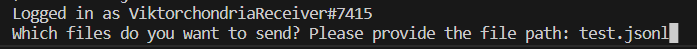
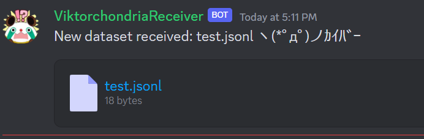

# Dataset tool
This guide will walk you through the steps to use the tool effectively. The tool helps in creating datasets manually. Follow these instructions to get started:

## Step 1: Install Node.js
Before using the tool, you need to have Node.js installed on your system. If you don't have it already, you can download and install it from the official website: Node.js.
https://nodejs.org/en

## Step 2: Open Terminal
After installing Node.js, open a terminal on your system.


Open Terminal

## Step 3: Run the Tool
In the terminal, navigate to the directory where the tool's main script (index.js) is located.

Type the following command and press Enter:

```bash
node index.js
```


//////////////////////////

# Exemple:


## Result:

```jsonl
{"ctx": "Kurisu dont like nicknames and is a closet @channeler", "prompt":"Fear not, Christina. Or should I call you... @channeler Chris!", "completion":" Please dont call me that..."}
```

## SENDING THE DATA

You can send the data by using this command:

```bash
node Send.js
```

It will ask you to enter a Token, it's available on the server in the "files" channel.

then type the name of your file, exemple:

```
dataset.jsonl
```






